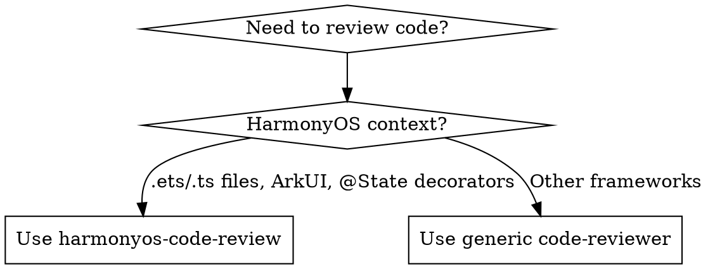

# HarmonyOS Code Review

## Overview

Systematic review for HarmonyOS applications using ArkTS and ArkUI. Catches bugs, performance issues, and security vulnerabilities through structured analysis.

**Core principle:** Review in priority order - compilation → errors → performance → security → architecture

## When to Use



**Use when:**
- File extensions are `.ets` or `.ts` in HarmonyOS context
- Checking ArkUI component implementations
- Reviewing async/await patterns in data fetching
- Evaluating state management with `@State`, `@Prop`, `@Provide`

**Do NOT use for:**
- Non-HarmonyOS code (use `superpowers:code-reviewer` instead)
- Writing new code (this is review only)
- Running tests or debugging

## Quick Reference

### Critical Checks by Priority

| Priority | Check | Severity | Pattern |
|----------|-------|----------|---------|
| 1 | async functions have try-catch-finally | 🔴 High | Missing finally → stuck loading |
| 2 | ForEach has key generator | 🟡 Medium | No key → poor list performance |
| 3 | Types/interfaces defined | 🔴 High | Missing types → runtime errors |
| 4 | API responses validated | 🟡 Medium | No validation → crashes from bad data |
| 5 | State flags reset in finally | 🔴 High | isLoading stuck forever on error |
| 6 | Components follow SRP | 🟡 Medium | Mixed concerns → unmaintainable |

### Red Flags - Immediate Review Required

If you see these, flag immediately:

- `async` function without try-catch
- `this.isLoading = true` without guaranteed reset
- `ForEach(this.items, ...)` with only 2 parameters (missing key)
- Direct assignment: `this.data = await apiCall()` (no validation)
- Type used but not defined: `@State data: UserType[]` (no interface)
- Data fetching in `aboutToAppear` without error handling
- Missing permission check on sensitive data access

**All of these require explicit mention in review.**

## Core Pattern

### Review Sequence

Follow this order to catch critical issues first:

1. **Compilation & Types** - Will it run?
2. **Error Handling** - Will it crash?
3. **Performance** - Will it lag?
4. **Security** - Is it safe?
5. **Architecture** - Is it maintainable?

### Common Mistakes

| Mistake | Fix |
|---------|-----|
| Missing finally block → loading stuck | Reset state flags in finally |
| No error handling in async → uncaught rejections | Wrap all async in try-catch |
| ForEach without key → poor list performance | Add third parameter: `(item) => item.id` |
| Direct API assignment → security risk | Validate responses before use |
| Component fetches data → SRP violation | Separate ViewModel/Service layer |

## Implementation

### Review Checklist

For each `.ets` or `.ts` file:

**1. Compilation & Types**
- [ ] All types/interfaces defined or imported
- [ ] No `any` types without justification
- [ ] Prop types match parent component's @State types

**2. Error Handling**
- [ ] All `async` functions have try-catch
- [ ] State flags reset in `finally`
- [ ] Error logging with context
- [ ] User feedback for errors

**3. Performance**
- [ ] ForEach has key generator
- [ ] Large datasets use pagination
- [ ] Expensive operations cache results

**4. Security**
- [ ] API responses validated before use
- [ ] Permission checks before data access
- [ ] No sensitive data in logs

**5. Architecture**
- [ ] Components have single responsibility
- [ ] Business logic separated from presentation
- [ ] Proper use of @State, @Prop, @Provide/@Consume

### Common Issues & Fixes

**Missing Error Handling**
```arkts
// ❌ BAD
async loadData() {
  this.isLoading = true;
  const data = await apiCall();
  this.data = data;  // If apiCall fails, isLoading never resets
  this.isLoading = false;
}

// ✅ GOOD
async loadData() {
  try {
    this.isLoading = true;
    const data = await apiCall();
    this.data = data;
  } catch (error) {
    Logger.error('Failed to load data', error);
  } finally {
    this.isLoading = false;  // Always executes
  }
}
```

**ForEach Without Key**
```arkts
// ❌ BAD
ForEach(this.items, (item: Item) => {
  ListItem() { Text(item.name) }
})

// ✅ GOOD
ForEach(this.items, (item: Item) => {
  ListItem() { Text(item.name) }
}, (item: Item) => item.id)  // Key generator
```

**Missing Type Definitions**
```arkts
// ❌ BAD
@State userList: User[] = [];  // User undefined

// ✅ GOOD
interface User {
  id: string;
  name: string;
  email?: string;
}

@State userList: User[] = [];
```

**No Data Validation**
```arkts
// ❌ BAD
this.userList = await UserService.getUsers();

// ✅ GOOD
const rawUsers = await UserService.getUsers();
this.userList = this.validateUsers(rawUsers);

private validateUsers(users: any[]): User[] {
  return users.filter(u => u && u.id && u.name);
}
```

**Violation of Single Responsibility**
```arkts
// ❌ BAD - Component does too much
@Entry
@Component
struct UserList {
  aboutToAppear() {
    this.loadUsers();  // Data fetching in UI
  }
  async loadUsers() {
    const users = await UserService.getUsers();  // Logic in component
  }
}

// ✅ GOOD - Separate concerns
// UserList.ets - Presentation only
@Entry
@Component
struct UserList {
  @State userList: User[] = [];
  aboutToAppear() {
    this.viewModel.loadUsers();
  }
}

// UserViewModel.ets - Business logic
class UserViewModel {
  async loadUsers() {
    const users = await UserService.getUsers();
    // Transform, validate, cache
  }
}
```

## Review Report Format

```markdown
## Code Review: [File Name]

### Critical Issues (🔴 Must Fix)
- **Issue**: Description
  - **Location**: Line X
  - **Risk**: What happens if not fixed
  - **Fix**: Code example

### Medium Priority (🟡 Should Fix)
...

### Low Priority (🟢 Nice to Have)
...

### Summary
Score: [X]/10
Top [N] issues to address
```

## Common Rationalizations

| Excuse | Reality |
|--------|---------|
| "HarmonyOS handles errors automatically" | No, uncaught async errors crash apps |
| "Key parameter is optional" | Optional = terrible performance on updates |
| "any is fine for quick prototype" | Technical debt compounds, fix it now |
| "Validation is unnecessary with trusted API" | APIs change, production breaks without validation |
| "Component works, separation is overkill" | Future changes require rewriting everything |

**All of these mean: Fix the issue now. Technical debt is not optional.**

## Real-World Impact

**Before this skill:**
- Agents miss `finally` block → loading states stuck
- Overlook missing ForEach keys → list performance issues
- Skip data validation → runtime crashes
- Mix concerns → unmaintainable components

**After this skill:**
- Structured review catches all critical issues
- Consistent feedback format
- HarmonyOS-specific patterns enforced
- Clear prioritization

## Batch Review Workflow

### Overview

For reviewing multiple git commits systematically, use the batch review workflow:

**Process Flow:**
1. **Collect** commits from git repository → export to CSV
2. **Review** each commit sequentially → generate individual reports
3. **Summarize** all reviews → aggregate statistics

### Step 1: Collect Commits

Use the CLI to collect commits into a CSV file:

```bash
# Collect commits from the last week
npm run collect -- --repo <path-to-repo> --output commits.csv --since "1 week ago"

# Collect specific number of commits
npm run collect -- --repo <path-to-repo> --output commits.csv --max 50

# Collect from specific branch
npm run collect -- --repo <path-to-repo> --output commits.csv --branch develop --since "2024-01-01"
```

**CSV Format:**
```csv
short_id,long_id,author,date,message,files_changed
a1b2c3d,a1b2c3d4e5f6g7h8i9j0k1l2m3n4o5p6q7r8s9t0u0v1w2x3,John Doe,2024-01-15,"Add login feature",5
```

### Step 2: Batch Review

Review all commits from the CSV file:

```bash
# Review all commits in CSV
npm run review -- --repo <path-to-repo> --csv commits.csv --output reports/

# Review limited number
npm run review -- --repo <path-to-repo> --csv commits.csv --output reports/ --max 10

# Resume from specific index (for interrupted reviews)
npm run review -- --repo <path-to-repo> --csv commits.csv --output reports/ --from 20
```

### Step 3: One-Command Execution

For convenience, use the single command to collect and review:

```bash
npm run run -- --repo <path-to-repo> --output review-output --since "1 week ago" --max-collect 100 --max-review 50
```

### Report Format

Each commit generates a separate report with strict format:

**File:** `commit-{shortId}-{timestamp}.md`

```markdown
# Commit 检视报告

## Commit 信息

| 字段 | 值 |
|------|-----|
| **Commit ID** | `a1b2c3d4e5f6g7h8i9j0k1l2m3n4o5p6q7r8s9t0u0v1w2x3` |
| **短 ID** | `a1b2c3d` |
| **提交消息** | Add login feature |
| **提交作者** | John Doe |
| **提交日期** | 2024-01-15 |
| **检视时间** | 2024-01-15T10:30:00Z |

## 检视统计

| 指标 | 数量 |
|------|------|
| **检视文件数** | 3 |
| **问题总数** | 5 |
| **🔴 严重** | 1 |
| **🟠 高** | 2 |
| **🟡 中等** | 1 |
| **🟢 轻微** | 1 |
| **🔵 提示** | 0 |

## 问题清单

| Commit ID | 文件路径 | 行号 | 问题描述 | 问题级别 |
|-----------|----------|------|----------|----------|
| a1b2c3d | `entry/src/main/ets/Login.ets` | 15 | async 函数缺少错误处理 | 🔴 严重 |
| a1b2c3d | `entry/src/main/ets/Login.ets` | 32 | ForEach 缺少 key 生成器 | 🟡 中等 |

### 🔴 严重问题

#### entry/src/main/ets/Login.ets:15

- **Commit ID**: `a1b2c3d4e5f6g7h8i9j0k1l2m3n4o5p6q7r8s9t0u0v1w2x3`
- **行号**: 15
- **规则**: AsyncErrorHandlingRule
- **级别**: 🔴 严重
- **问题描述**: async 函数缺少 try-catch 错误处理
- **修复建议**: 使用 try-catch-finally 包裹异步操作
```

### Standard Issue Fields

Every issue in the report follows this strict format:

| Field | Type | Description |
|-------|------|-------------|
| **commit-id** | string | Full 40-character commit hash |
| **文件路径** | string | Relative path from repo root |
| **行号** | number | Starting line number of the issue |
| **问题描述** | string | Clear description of the problem |
| **问题级别** | enum | 🔴 严重 / 🟠 高 / 🟡 中等 / 🟢 轻微 / 🔵 提示 |

### Output Directory Structure

```
review-output/
├── commits.csv                                    # Collected commits
├── reports/
│   ├── commit-a1b2c3d-1705300000000.md           # Individual commit reports
│   ├── commit-d4e5f6g-1705300100000.md
│   └── ...
└── summary-1705300200000.md                       # Aggregated summary
```

### Programmatic Usage

For direct TypeScript/JavaScript usage:

```typescript
import { collectCommitsToCSV, CollectOptions } from './src/utils/commit-collector';
import { batchReviewCommits, BatchReviewOptions } from './src/utils/batch-reviewer';

// Step 1: Collect commits
const collectOptions: CollectOptions = {
  repoPath: '/path/to/repo',
  outputPath: './commits.csv',
  since: '1 week ago',
  maxCount: 100
};
const commits = collectCommitsToCSV(collectOptions);

// Step 2: Batch review
const reviewOptions: BatchReviewOptions = {
  repoPath: '/path/to/repo',
  csvPath: './commits.csv',
  outputDir: './reports',
  maxCommits: 50
};
const reports = await batchReviewCommits(reviewOptions);

// Process results
console.log(`Reviewed ${reports.length} commits`);
console.log(`Total issues: ${reports.reduce((sum, r) => sum + r.totalIssues, 0)}`);
```

### When to Use Batch Review

**Use batch review when:**
- Reviewing a PR/MR with multiple commits
- Checking development history for code quality
- Auditing a feature branch before merge
- Analyzing team coding patterns over time
- Generating quality metrics for reporting

**Do NOT use batch review for:**
- Single file quick checks (use standard review instead)
- Real-time code writing feedback
- Non-HarmonyOS projects

### Best Practices

1. **Start Small**: Test with `--max-review 5` before running on large datasets
2. **Use Filters**: Apply `--since` and `--max-collect` to limit scope
3. **Resume Support**: Use `--from` index to continue interrupted reviews
4. **Check Summary**: Always review the generated `summary-*.md` file first
5. **Archive Reports**: Keep historical reports for trend analysis

## Advanced Patterns

### ViewModel Pattern (Recommended)

```arkts
export class UserListViewModel extends Observable {
  @Track userList: User[] = [];
  @Track isLoading: boolean = false;

  async loadUsers(): Promise<void> {
    try {
      this.isLoading = true;
      const rawUsers = await this.userService.getUsers();
      this.userList = this.validateAndTransform(rawUsers);
    } catch (error) {
      Logger.error('Failed to load users', error);
    } finally {
      this.isLoading = false;
    }
  }
}
```

### Custom Hooks Pattern

```arkts
export function useUserData() {
  const [users, setUsers] = useState<User[]>([]);
  const [isLoading, setIsLoading] = useState<boolean>(false);
  const [error, setError] = useState<Error | null>(null);

  const loadUsers = async () => {
    try {
      setIsLoading(true);
      setError(null);
      const data = await UserService.getUsers();
      setUsers(data);
    } catch (err) {
      setError(err as Error);
      Logger.error('Failed to load users', err);
    } finally {
      setIsLoading(false);
    }
  };

  return { users, isLoading, error, loadUsers };
}
```
